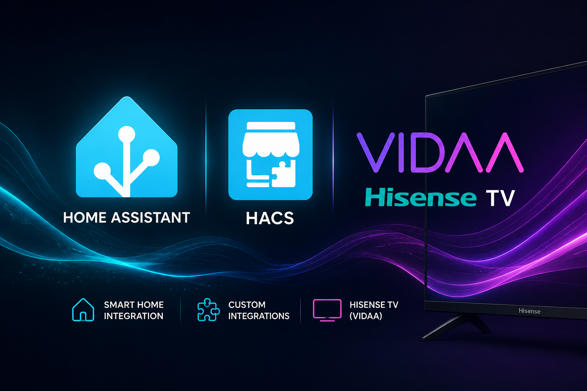

# Hisense Laser TV for Home Assistant

Custom Home Assistant integration for local control of Hisense Laser TV / VIDAA
projectors over the device MQTT control port.

Tested with a Hisense `HE100L5` Laser TV on firmware
`V0000.01.00L.P0301`, transport protocol `1140`.

## Features

- Local MQTT control on port `36669`
- Config flow from the Home Assistant UI
- SSDP discovery plus manual network scan
- VIDAA legacy-app pairing flow with PIN entry
- Power, volume, mute, source selection, play, pause, stop
- Wake-on-LAN and VIDAA Android-app wake packet support when a MAC address is configured
- Extra remote keys through `media_player.send_command` when available

## Install

### HACS custom repository

1. Open HACS in Home Assistant.
2. Open the menu in the top right and choose **Custom repositories**.
3. Add this repository URL:

```text
https://github.com/theappartment/hisense-laser-tv-ha
```

4. Choose category **Integration**.
5. Install **Hisense Laser TV**.
6. Restart Home Assistant.
7. Go to **Settings > Devices & services > Add integration > Hisense Laser TV**.

### Manual install

Copy this folder into Home Assistant:

```text
custom_components/hisense_laser_tv
```

The final path must be:

```text
/config/custom_components/hisense_laser_tv
```

Restart Home Assistant, then go to:

```text
Settings > Devices & services > Add integration > Hisense Laser TV
```

## Wake from standby

When a MAC address is configured, `turn_on` sends both:

- a standard Wake-on-LAN magic packet
- the legacy VIDAA Android app wake packet on UDP broadcast port `33129`

The VIDAA packet is sent five times, 100 ms apart, matching the behavior found
in the Android app. Wi-Fi wake support still depends on projector firmware,
network standby settings, and router/access point broadcast handling.

## Pairing

Some VIDAA firmware accepts local control only from a paired mobile-app
identity. During setup, keep the projector powered on and on the VIDAA home
screen.

1. Add the integration in Home Assistant.
2. Enter the projector IP address or use discovery/scan.
3. If the projector shows a PIN, enter it in the Home Assistant pairing field.
4. Home Assistant stores the paired VIDAA app identity in the config entry.

If the entity is created but remains unavailable, open Home Assistant logs and
look for `custom_components.hisense_laser_tv`.

## Certificates

VIDAA/RemoteNOW models may require the legacy mobile-app TLS client
certificate. This repository does not ship private-key material.

The integration looks for these files:

```text
remoteclientmobile.crt
remoteclientmobile.key
```

Supported locations:

```text
/ssl/remoteclientmobile.crt
/ssl/remoteclientmobile.key
/config/ssl/remoteclientmobile.crt
/config/ssl/remoteclientmobile.key
/config/custom_components/hisense_laser_tv/certs/remoteclientmobile.crt
/config/custom_components/hisense_laser_tv/certs/remoteclientmobile.key
```

For personal use, these can be extracted from a compatible legacy VIDAA /
RemoteNOW Android APK. With OpenSSL 3, legacy PKCS#12 files may need the
`-legacy` flag:

```bash
openssl pkcs12 -legacy -in remoteclientmobile.p12 -clcerts -nokeys \
  -out remoteclientmobile.crt -passin pass:multiscreen123

openssl pkcs12 -legacy -in remoteclientmobile.p12 -nocerts -nodes \
  -out remoteclientmobile.key -passin pass:multiscreen123
```

Only use certificate files you are legally allowed to use.

For the most convenient Home Assistant setup, put the files in:

```text
/config/ssl/remoteclientmobile.crt
/config/ssl/remoteclientmobile.key
```

Then leave the certificate fields at their default values during setup.

## Discovery

Automatic discovery uses SSDP/UPnP. It works when Home Assistant and the
projector are on the same network and Home Assistant can receive multicast
traffic.

If SSDP does not show the projector:

1. Choose **Add integration > Hisense Laser TV**.
2. Choose **Scan local network**.
3. Enter a CIDR such as `192.168.1.0/24`.

The scan checks for the local VIDAA MQTT port `36669`.

## Notes

This is an unofficial integration. Hisense/VIDAA does not publish this local
MQTT API as a stable public API, so firmware differences are expected.

The integration was created because older Python libraries for Hisense TVs
depend on `paho-mqtt` versions that conflict with modern Home Assistant.
